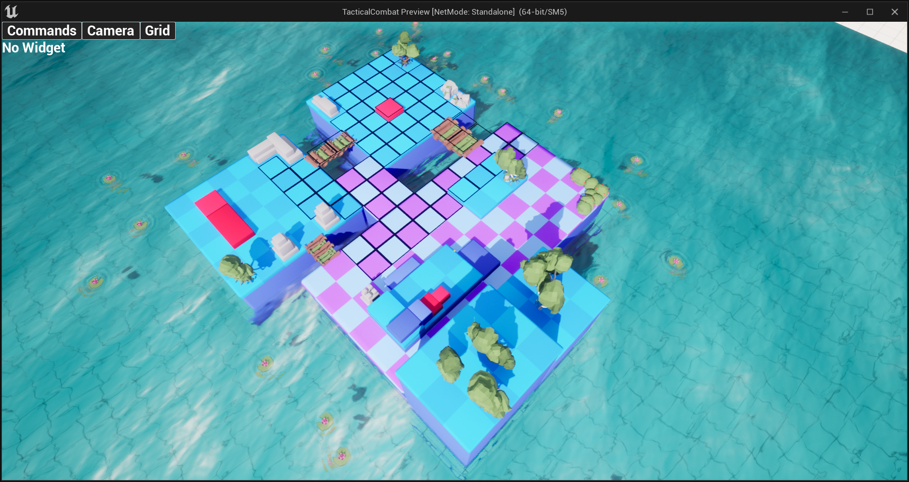
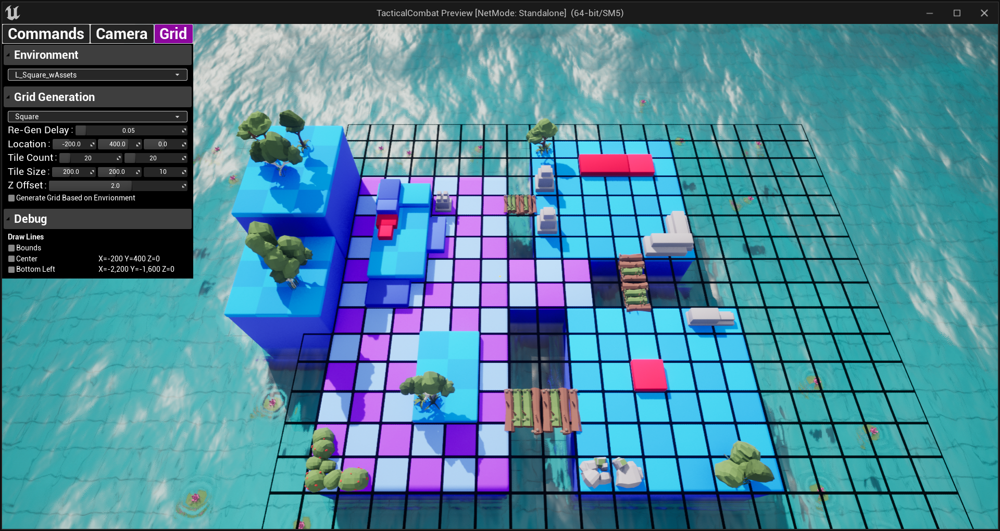

# TacticalCombat

Tactical Strategy Game Inspired by Sid Meir's Civilization Series

## Features
- Easy to Change between Square, Triangle, Hex Gird.
- Highly Optimized Instanced Grid System
- Easy Debugging through RunTime Editor

## Screenshots

> In Game View

> RunTime Debug with InGame Debug Editor

## Requriements

- Unreal Engine 5.1
- Visual Studio Community 2022
